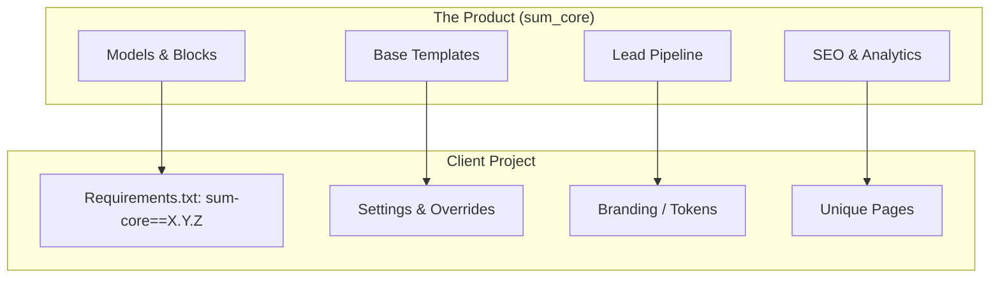
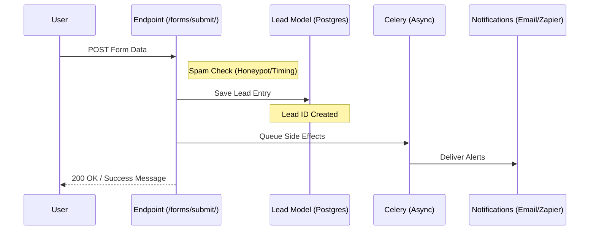

# SUM Platform Handbook

> The definitive guide to building, deploying, and maintaining lead-focused websites with the SUM Platform.

---

## 🧭 Introduction

The SUM Platform is a Django/Wagtail-based foundation designed for the rapid deployment of high-performance websites for the home improvement industry. This handbook serves as the central entry point for all contributors and operators.

- **Speed to Value**: Launch a production-ready site in 2–3 days.
- **Lead-First Design**: Every feature is optimized for conversion.
- **Maintainability**: A shared core (`sum_core`) with swappable Tailwind-based themes.
- **AI-Native**: Structured for efficient assistance from AI coding agents.

### Technology Stack & Baseline

| Component        | Technology                                    | Version | Notes                          |
| ---------------- | --------------------------------------------- | ------- | ------------------------------ |
| **Language**     | Python                                        | 3.12.x  |                                |
| **Framework**    | Django (LTS)                                  | 5.2.x   | Core web engine                |
| **CMS**          | Wagtail (LTS)                                 | 7.0.x   | Content & Admin                |
| **Database**     | PostgreSQL                                    | 17.x    | Per-client isolation           |
| **Cache/Broker** | Redis                                         | 7.x/8.x | **Required** for health status |
| **Task Queue**   | Celery                                        | 5.6.x   | Async leads/webhooks           |
| **CSS**          | Tailwind v3.4.x                               | 3.4.x   | Theme-based styling system     |
| **Themes**       | Fixed per-site (v0.6+)                        | —       | Visual systems with Tailwind   |

#### Critical Environment Variables

All projects require these baseline variables to function in production:

- `DJANGO_DB_NAME`, `DJANGO_DB_USER`, `DJANGO_DB_PASSWORD`, `DJANGO_DB_HOST`
- `CELERY_BROKER_URL` (usually Redis)
- `LEAD_NOTIFICATION_EMAIL` (destination for form submissions)
- `DEFAULT_FROM_EMAIL` (the sender address)
- `SENTRY_DSN` (for observability)

---

---

## 🚀 Quick Start

For those ready to dive straight in.

1. **Environment Setup**:
   ```bash
   python3.12 -m venv .venv
   source .venv/bin/activate
   make install-dev
   ```
2. **Launch Development Server**:
   ```bash
   make run
   ```
3. **Access Admin**: [http://localhost:8000/admin/](http://localhost:8000/admin/)

---

## 👥 Personas: Find Your Path

### 👨‍💻 I am a Platform Developer

_You build the engine._

- **Focus**: `sum_core/`, block development, model logic.
- **Read**: [Agent Orientation](dev/AGENT-ORIENTATION.md), [Hygiene Standards](dev/hygiene.md).
- **Tool**: `make test`, `make lint`.

### 🚀 I am a Site Operator / DevOps

_You launch and maintain sites._

- **Focus**: `cli/`, `boilerplate/`, deployments, upgrades.
- **Read**: [Operations Router](ROUTER.md), [VPS Golden Path](dev/deploy/vps-golden-path.md).
- **Tool**: `sum init`, `sum check`, `make deploy`.

### ✍️ I am a Content Editor / Marketer

_You drive leads and manage content._

- **Focus**: Wagtail Admin, SEO settings, Lead Dashboard.
- **Read**: [Block Reference](dev/blocks-reference.md), [Page Types](dev/page-types-reference.md).
- **Tool**: Wagtail Admin (/admin).

---

See the [Root README](../README.md) for detailed setup requirements.

---

## 🏗️ Platform Architecture

SUM uses a **Core-Client pattern**.

- **`sum_core`**: The engine. Contains all models, blocks, logic, and base styles.
- **Client Projects**: The shell. Contains site-specific settings, overrides, and unique content.

### Key Links

- [Codebase Structure](dev/CODEBASE-STRUCTURE.md)
- [Agent Orientation](dev/AGENT-ORIENTATION.md)
- [Single Source of Truth (SSOT)](dev/master-docs/SUM-PLATFORM-SSOT.md)

### The Core-Client Relationship

The SUM Platform uses a "Core-Client" architecture where the product logic is centralized in `sum_core`, while individual client projects act as thin skins.



#### Multi-Site Strategy

- **Per-client project**: Each client (slug) is a standalone Django/Wagtail project.
- **Separate databases**: `sum_<client_slug>` per site for data isolation.
- **Version pinning**: Clients pin `sum-core==X.Y.Z` explicitly to prevent ghost updates.

### Repository Structure

- **`core/sum_core/`**: The installable engine.
  - `blocks/`: StreamField definitions (data structures only).
  - `pages/`: Abstract and concrete page models.
  - `leads/`: Persistence and attribution logic.
  - `branding/`: SiteSettings and branding template tags.
  - `navigation/`: Header/Footer model logic.
  - `seo/` & `analytics/`: Technical marketing hooks.
  - `test_project/`: The internal development harness.
- **`themes/`**: Canonical theme source files (Tailwind-based visual systems).
  - `theme_a/`: "Sage & Stone" theme (templates, CSS, Tailwind config).
  - _(Future themes will be added here)_
- **`boilerplate/`**: The official starter template for new clients.
- **`cli/`**: Python source for the `sum` CLI.
- **`clients/`**: The deployment shells for live sites.
  - `<client>/theme/active/`: Client's active theme (copied at init-time).
- **`infrastructure/`**: Systemd unit files and Caddy/Nginx configs.

---

## 🔌 Wiring: Connecting Client to Core

"Wiring" is the process of making a client project SUM-compatible. Every client project must follow this inventory.

### 1. INSTALLED_APPS

Client projects must include these in `settings/base.py`:

```python
INSTALLED_APPS = [
    # ... Wagtail apps ...
    "sum_core",
    "sum_core.pages",
    "sum_core.navigation",
    "sum_core.leads",
    "sum_core.forms",
    "sum_core.analytics",
    "sum_core.seo",
    "home", # Your local homepage app
]
```

### 2. URL Patterns

Required inclusions in `urls.py`:

```python
urlpatterns = [
    path("admin/", include(wagtailadmin_urls)),
    path("forms/", include("sum_core.forms.urls")), # Submissions
    path("", include("sum_core.ops.urls")),         # /health/
    path("", include("sum_core.seo.urls")),         # sitemap, robots.txt
    path("", include(wagtail_urls)),                # Must be last
]
```

### 3. Middleware

`sum_core.ops.middleware.CorrelationIdMiddleware` should be the first entry in your `MIDDLEWARE` list to ensure every request (and log) has a unique ID.

### 4. Theme Integration

Client projects must have a theme installed at `theme/active/`:

**Template Loaders** (in `settings/base.py`):
```python
TEMPLATES = [{
    'BACKEND': 'django.template.backends.django.DjangoTemplates',
    'DIRS': [
        BASE_DIR / 'theme' / 'active' / 'templates',  # Theme templates (highest priority)
        BASE_DIR / 'templates',                       # Client overrides
    ],
    'APP_DIRS': True,  # Allows sum_core templates as fallback
}]
```

**Static Files**:
```python
STATICFILES_DIRS = [
    BASE_DIR / 'theme' / 'active' / 'static',  # Theme static files
]
```

For complete theme wiring details, see [Wiring Inventory: Theme Wiring](dev/WIRING-INVENTORY.md#theme-wiring-v06).

#### The Lead Pipeline

Every form submission on a SUM site follows this "No Lost Leads" path.



---

## 🧩 Building Blocks & Pages

The platform is powered by Wagtail StreamField. Blocks are grouped into categories: **Hero**, **Sections**, **Page Content**, and **Forms**.

### Page Types Reference

#### 1. `HomePage` (Client-Owned)

The flagship landing page. It is defined in the client project (not core) but consumes core blocks.

- **Key Fields**: `intro` (RichText), `body` (PageStreamBlock).
- **Subpage Types**: Usually allows `ServiceIndexPage`, `StandardPage`, `ContactPage`.

#### 2. `StandardPage` (Core)

General-purpose content page for About, FAQ, Privacy, etc.

- **Key Fields**: `body` (PageStreamBlock).
- **Module**: `sum_core.pages.standard.StandardPage`.

#### 3. `ServicePage` (Core)

Individual detail pages for business services.

- **Key Fields**: `body`, `featured_image`, `short_description`.
- **Hierarchy**: Must be a child of `ServiceIndexPage`.

---

### Core Block Catalog

#### Hero Image (`hero_image`)

High-impact section with background image and text overlay.

- **Fields**:
  - `headline`: RichText (supports `italic` for accent tagging).
  - `subheadline`: Text.
  - `image`: ImageChooserBlock.
  - `ctas`: List of 0–2 buttons.
  - `floating_card_label/value`: Optional desktop-only accent card.

#### Service Cards (`service_cards`)

A responsive grid for lists of services.

- **Fields**:
  - `heading`: Section heading.
  - `cards`: List of icons/images + titles + descriptions.
- **UX**: Horizontally scrolls on mobile, grid on desktop.

#### Testimonials (`testimonials`)

A dedicated social proof section.

- **Fields**:
  - `testimonials`: List of quotes + author name + photo + rating (1–5).

#### FAQ (`faq`)

Accordion-style questions.

- **Fields**:
  - `items`: List of Question/Answer pairs.
- **SEO**: Automatically generates `FAQPage` JSON-LD schema.

---

### Global Page Features

- **SEO & Meta**: Every page includes `seo_title`, `search_description`, and `og_image`.
- **Structured Data**: `` automatically builds schemas based on page type and content (e.g., LocalBusiness, Article).
- **Navigation**: Managed in `Wagtail Settings`. The sidebar mobile CTA is configured in `HeaderSettings`.
- **Reveal Animations**: Theme-specific (e.g., Theme A provides `.reveal` classes for entrance animations).

### Block Rendering & Themes

**Important**: Block templates are provided by your active theme, not by `sum_core`.

- **Core provides**: Block field definitions (`sum_core/blocks/`) defining what data can be entered.
- **Theme provides**: Templates (`theme/active/templates/sum_core/blocks/`) defining how blocks render visually.
- **Result**: Same block data renders differently across themes—each theme has its own visual interpretation.

When developing custom blocks or modifying existing ones:
1. Update the block definition in `sum_core/blocks/` (data structure)
2. Update the template in your theme's `templates/sum_core/blocks/` directory (visual rendering)
3. Ensure new Tailwind classes are included in your theme's CSS build

### Development Guidelines

- Follow the [Hygiene Standards](dev/hygiene.md).
- Reference the [Navigation System](dev/NAV/navigation.md).
- Review your theme's README for styling conventions.
- For Theme A, see [Theme A Documentation](../themes/theme_a/README.md).

---

## 🎨 Design & Theming

SUM uses a **Tailwind-based theme system** that allows fixed, swappable base themes per client site. Each theme is selected at initialization time and provides complete visual identity while maintaining compatibility with the `sum_core` engine.

### Theme Architecture

**Philosophy**: "Build the Frame, Inject the Paint"

- **Themes are fixed per site**: Selected during `sum init`, not changed at runtime.
- **Tailwind-first styling**: Component structure and layout built with utility classes.
- **CSS variables for branding**: Runtime color/font customization without rebuilding CSS.
- **`sum_core` stays presentation-agnostic**: Core logic doesn't assume a specific theme.

### Current Themes

#### Theme A: "Sage & Stone" (`theme_a`)

Premium theme featuring:
- Reveal animations and elegant transitions
- Mega menu navigation system
- Sophisticated typography pairing
- Natural color palette (sage, terra, stone, linen)

**Key Details:**
- **Location**: `themes/theme_a/`
- **Version**: 1.0.0
- **Tailwind**: v3.4.x
- **Documentation**: [Theme A README](../themes/theme_a/README.md)

### How Themes Work

#### Theme Structure

Each theme provides:

```
themes/<theme_slug>/
├── theme.json              # Theme manifest (name, version, description)
├── templates/              # Django templates (base.html + page/component partials)
│   ├── theme/             # Theme-specific templates
│   └── sum_core/          # Overrides for core templates
├── static/<theme_slug>/   # Static assets
│   ├── css/
│   │   ├── input.css      # Tailwind source
│   │   └── main.css       # Compiled output (committed)
│   └── js/
│       └── main.js        # Theme JavaScript
├── tailwind/              # Tailwind build toolchain
│   ├── tailwind.config.js
│   ├── postcss.config.js
│   └── package.json
└── README.md              # Theme-specific documentation
```

#### Client Integration

When you run `sum init <client> --theme <theme_slug>`, the theme is copied to:

```
clients/<client>/theme/active/
```

Django template loaders are configured to prioritize:
1. `clients/<client>/theme/active/templates/` (theme templates)
2. `clients/<client>/templates/overrides/` (client-specific overrides)
3. `sum_core/templates/` (fallback core templates)

### Branding Customization

Themes use **CSS variables** for brand-specific values, allowing runtime customization through Wagtail `SiteSettings` **without rebuilding CSS**.

#### CSS Variable System (Theme A Example)

| Variable             | Default (RGB)   | Purpose                  |
| -------------------- | --------------- | ------------------------ |
| `--color-sage-black` | 26 47 35        | Primary text             |
| `--color-sage-linen` | 247 245 241     | Background               |
| `--color-sage-terra` | 160 86 59       | Primary accent (CTAs)    |
| `--color-sage-moss`  | 85 111 97       | Secondary accent         |
| `--color-sage-stone` | 143 141 136     | Neutral elements         |

Tailwind classes reference these variables:

```js
// tailwind.config.js
colors: {
  'sage-terra': 'rgb(var(--color-sage-terra, 160 86 59) / <alpha-value>)'
}
```

This enables:
- **Default values**: Embedded in the Tailwind config (160 86 59)
- **Runtime overrides**: CSS variables injected via ``
- **Opacity modifiers**: Tailwind utilities like `bg-sage-terra/50`

### Typography System

Theme A provides a semantic type scale using Tailwind utilities:

| Role        | Typical Classes                       | Purpose                          |
| ----------- | ------------------------------------- | -------------------------------- |
| **Display** | `text-4xl lg:text-6xl font-semibold` | Hero headlines, large statements |
| **Heading** | `text-3xl lg:text-4xl font-semibold` | Section titles, page headers     |
| **Lead**    | `text-xl lg:text-2xl`                 | Intro paragraphs, emphasis       |
| **Body**    | `text-base lg:text-lg`                | Primary content                  |
| **Small**   | `text-sm lg:text-base`                | Secondary info, captions         |

Refer to your theme's templates for exact class combinations.

### Theme Development

For site operators: **You don't need Node.js or npm** to run a site. The compiled CSS is committed and ships with the theme.

For theme maintainers modifying styles:

```bash
cd themes/theme_a/tailwind
npm install              # One-time setup
npm run build            # Production build (minified)
npm run watch            # Watch mode for development
```

Always commit both source and compiled CSS:

```bash
git add static/theme_a/css/input.css static/theme_a/css/main.css
git commit -m "theme: update styles"
```

### Migration Notes

**Historical Context**: The platform originally used a vanilla CSS token-based system. As of v0.6, we've transitioned to the Tailwind-based theme architecture described above for better AI-agent ergonomics and faster theme development.

If you encounter references to `tokens.css` or HSL branding in older documentation, they refer to the legacy system and should be disregarded in favor of this theme architecture.

---

## 📥 Leads & Integrations

The "reason for being" for the platform. We ensure **No Lost Leads** through a persistent, failure-resistant pipeline.

### The Pipeline Flow

1. **Submit**: Submits to `POST /forms/submit/`.
2. **Persistence**: The lead is saved to the Postgres database **immediately**. This step _must_ succeed before any side effects happen.
3. **Async Tasks**: Celery workers handle notifications (Email) and external integrations (Zapier webhooks).

### Spam Protection

- **Honeypot**: A hidden `website` field. If filled, the lead is silently discarded.
- **Rate-Limiting**: 5 submissions per IP per hour.
- **Timing Check**: Rejects submissions that occur too quickly (bot detection).

### Attribution System

We automatically capture and normalize source data:

- **UTMs**: source, medium, campaign, content.
- **Referrer**: Tracks where the user came from (e.g., `google.com`).
- **Logic**: Automatically classifies leads as `google_ads`, `seo`, `referral`, or `direct` based on headers.

---

## 🛠️ Operations & Maintenance

Day-to-day operations are managed through the Monorepo tooling and the `sum` CLI.

### Release & Versioning

We use **git tag pinning** for distribution (no PyPI).

- **Versioning**: `v0.MINOR.PATCH` (e.g., `v0.3.1`).
- **Minor**: New features (Wagtail models, blocks).
- **Patch**: Bug fixes, docs, or test-only changes.
- **Pinning**: Client projects pin to exact tags in `requirements.txt`:
  `sum-core @ git+https://github.com/ORG/REPO.git@v0.x.y#subdirectory=core`

### The "Loop" Practice

Our QA philosophy centers on "The Loop"—upgrading multiple live client sites sequentially to verify a core release.

1. **Develop**: Core changes in `sum_core`.
2. **Release Prep**: Run `make release-check` to verify lint, tests, and CLI sync.
3. **Pinning**: Run `make release-set-core-ref REF=v0.x.y` to update the boilerplate.
4. **Tagging**:
   ```bash
   git tag -a v0.x.y -m "Release v0.x.y"
   git push origin v0.x.y
   ```
5. **Upgrade**: Run `pip install --upgrade` on loop sites and perform smoke tests.
6. **Learn**: Log failures in `what-broke-last-time.md`.

### [Full Release Procedure]

To cut a release properly, follow these steps exactly:

- Verify `__init__.py` version matches the intended tag.
- Ensure all migrations are committed.
- Verify the `boilerplate/` pins to the _new_ tag (even before it exists locally).
- Push the tag _first_, then the `main` branch.

### Major Commands

| Domain      | Command                            | Purpose                                       |
| ----------- | ---------------------------------- | --------------------------------------------- |
| **Dev**     | `make lint`                        | Ruff, Mypy, Black, and Isort checks           |
| **Dev**     | `make test`                        | Run complete Pytest suite                     |
| **Release** | `make release-check`               | Pre-flight checks before tagging              |
| **CLI**     | `sum init <slug> --theme <theme>`  | Scaffold a new client project with theme      |
| **CLI**     | `sum check`                        | Verify environment and core wiring            |
| **Theme**   | `cd themes/<theme>/tailwind`       | Navigate to theme build directory             |
| **Theme**   | `npm run build`                    | Compile theme CSS (production)                |
| **Theme**   | `npm run watch`                    | Watch mode for theme development              |
| **Ops**     | `make deploy`                      | Production sync (environment specific)        |

### Production Deployment (The Golden Path)

Our standard target is a **Linux VPS** (Ubuntu LTS) with:

1. **Web Server**: Caddy or Nginx (TLS via Let's Encrypt).
2. **App Server**: Gunicorn (systemd-managed).
3. **Storage**: Postgres 17 + Redis 7+ (Redis is required for baseline health).
4. **Process Manager**: Systemd handles all services.

---

## 📖 Glossary

- **`sum_core`**: The primary Django package containing all shared platform logic (models, blocks, business logic).
- **Theme**: A complete visual system providing templates, CSS, and styling for a client site. Fixed at init-time.
- **Theme A ("Sage & Stone")**: The first production theme, featuring Tailwind-based styling, reveal animations, and a natural color palette.
- **Tailwind**: The utility-first CSS framework used for theme styling (v3.4.x for CSS variable compatibility).
- **Wiring**: The process of connecting a client project to `sum_core` (settings, URLs, apps, theme integration).
- **The Loop**: Upgrading multiple sites in a row to verify a new core version.
- **CM (Corrective Mission)**: A targeted audit and fix session (e.g., CM-001) for specific logic.
- **Wiring Inventory**: A checklist of everything a client project needs (apps, settings, URLs, theme setup).
- **Harness**: A minimal Django project inside `core/sum_core/test_project/` used for testing core functionality.
- **Tag Pinning**: Explicitly versioning `sum-core` in `requirements.txt` via git hash or tag.
- **Block**: A reusable content component. Core defines the data structure; themes define visual rendering.
- **CSS Variables**: Runtime-customizable design values (colors, fonts) injected via `` for brand overrides without rebuilding CSS.

---

## 🎓 Tutorials

### How to Create a New Block

1.  **Define the Model**: Create a new class in `sum_core/blocks/` inheriting from `BaseBlock` or `StructBlock`.
    - This defines the **data structure** and fields editors can fill in.
    - Example: `core/sum_core/blocks/hero.py`

2.  **Register It**: Add it to the appropriate StreamBlock in `sum_core/blocks/__init__.py`.

3.  **Create the Template**: Add a `.html` file in your theme's templates directory.
    - For Theme A: `themes/theme_a/templates/sum_core/blocks/<block_name>.html`
    - This defines the **visual rendering** of the block.

4.  **Style It**: Add Tailwind classes directly in the template, or custom CSS if needed.
    - For custom CSS: Add to `themes/theme_a/static/theme_a/css/input.css`
    - Run `npm run build` in `themes/theme_a/tailwind/` to compile.

5.  **Test It**: Add a rendering test in `core/sum_core/tests/blocks/`.
    - Verify data structure and template rendering work correctly.

**Note**: Blocks define data structures in `sum_core`, but visual rendering is theme-specific. The same block can look different across themes.

### Launching Your First Site

1.  **Init**: Run `sum init my-new-client --theme theme_a` to scaffold a new client project with Theme A.
2.  **Environment**: Configure your environment variables (database, email, etc.) in `.env`.
3.  **Migrate**: Run database migrations: `python manage.py migrate`.
4.  **Configure**: Set up `SiteSettings` in the Wagtail Admin (colors, fonts, logos, business info).
5.  **Content**: Create your homepage and initial pages through the Wagtail Admin.
6.  **Deploy**: Use the [VPS Golden Path](dev/deploy/vps-golden-path.md) to push to production.

---

## 📚 Documentation Map (The "DDD")

For a full inventory of every document in this repository, see the **[Documentation Documentation Document (DDD.md)](DDD.md)**.

### Vital Strategic Documents

- [Post-MVP Expansion Plan](dev/master-docs/POST-MVP_BIG-PLAN.md)
- [Product Requirements (PRD)](dev/master-docs/prd-sum-platform-v1.1.md)
- [Theme Architecture Spec v1](dev/master-docs/THEME-ARCHITECTURE-SPECv1.md)
- [Release Workflow](dev/release-workflow.md)

---

## 🔮 Next Steps for Documentation

This handbook is now a functional guide, but it can be further deepened:

1. **Theme Gallery**: Create visual examples and screenshots of available themes (starting with Theme A).
2. **Theme Development Guide**: Comprehensive tutorial for creating a new theme from scratch.
3. **In-Depth Tutorials**: Expand the "How to" section with complete code examples for writing your first rendering test and overriding a theme template.
4. **Video Demos**: Link to (or placeholder for) loom/video walk-throughs of the `sum` CLI and theme customization.
5. **Automated Search**: Explore integrating a documentation search tool (like MkDocs or similar) if the volume continues to grow.
6. **Interactive Diagrams**: Convert the Mermaid diagrams into interactive SVG/HTML components if we move to a hosted documentation site.
