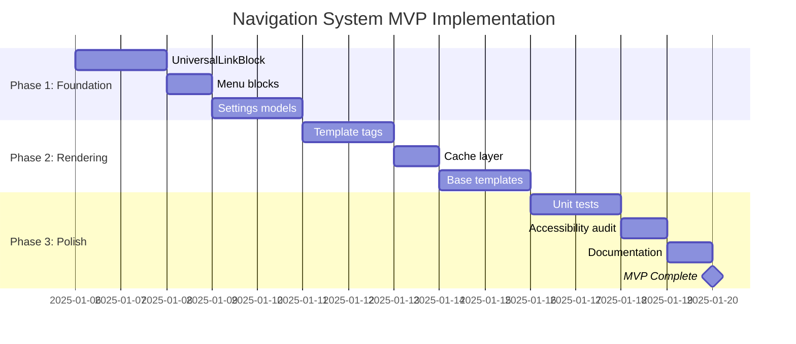

# Navigation & Menu System - Micro-Project Specification

**Project:** SUM Platform Enhancement
**Feature:** Site-Wide Navigation & Menu Management System
**Version:** 1.1
**Date:** December 12, 2025
**Status:** Build-Ready
**Parent Document:** SUM Platform PRD v1.1, Technical Specification v0.2

---

## Table of Contents

1. [Introduction & Objectives]
2. [Product Requirements]
3. [Strategy & Recommended Approach]
4. [System Architecture]
5. [Implementation Plan]
6. [Testing Strategy]
7. [Appendices]

---

## 1. Introduction & Objectives

### 1.1 Problem Statement

The current SUM Platform implementation has neglected a critical component: the site-wide navigation system. While Milestone 1 includes "Base layout templates: base.html, header, footer, navigation includes" and the PRD references header/footer template includes, there is no formal specification for:

- **Main header navigation** – Desktop and mobile responsive navigation
- **Mobile menu system** – Hamburger menu, slide-out drawer
- **Footer navigation** – Multi-column link sections, service area pages, legal links
- **Sticky/overlay CTAs** – Persistent "Get a Quote" or "Call Now" buttons for mobile
- **Internal page linking** – CTA buttons that link to internal Wagtail pages (not just URLs)
- **Menu management** – Admin interface for editors to configure navigation without code changes

This gap creates significant UX and maintainability issues:

- **Editor Frustration:** Adding pages to navigation requires developer intervention
- **Broken Links:** Hard-coded navigation breaks when pages move or rename
- **Manual Link Formatting:** Editors must manually type `mailto:` or `tel:` prefixes
- **Mobile Conversion Loss:** No persistent CTAs for high-intent mobile visitors
- **Inflexibility:** Cannot adapt navigation structure per client without code changes

### 1.2 Objectives

| Objective                   | Success Metric                                             | Target                             |
| --------------------------- | ---------------------------------------------------------- | ---------------------------------- |
| CMS-managed main navigation | Menu changes without code deployment                       | 100% of nav changes                |
| CMS-managed footer          | Footer links editable in admin                             | Full admin control                 |
| Universal linking           | All link types (page, URL, email, phone, anchor) supported | Zero manual `mailto:`/`tel:` hacks |
| Mobile CTA configuration    | Sticky CTA configurable per site                           | < 15 min to configure              |
| Multi-site isolation        | Each site has independent navigation                       | Zero cross-site bleed              |
| Performance                 | Navigation render time                                     | < 50ms cached                      |

### 1.3 Scope

**In Scope (MVP):**

- Header navigation settings model (per-site)
- Footer navigation settings model (per-site)
- StreamField blocks for menu items with nested dropdown support (2 levels)
- **UniversalLinkBlock** with 5 link types (page, URL, email, phone, anchor)
- Template tags for rendering navigation
- Mobile sticky CTA configuration
- Caching with explicit invalidation
- Accessibility baseline (keyboard nav, ARIA for dropdowns)
- Unit tests for block validation, rendering, cache keying

**Out of Scope (Future Consideration):**

- Navigation variants (seasonal, campaign-specific) — trivial to add later
- Mega menus with rich content/images
- Multi-level dropdown submenus (beyond 2 levels supported MVP)
- User authentication-based menu visibility
- A/B testing of navigation variants
- Language/locale-specific menus
- Visual drag-and-drop menu builder

### 1.4 Design Principles

**Core Requirements vs. Optional Enhancements**

This specification distinguishes between:

| Category                 | Definition                                                         | MVP Status   |
| ------------------------ | ------------------------------------------------------------------ | ------------ |
| **Core Requirement**     | Data model, rendering logic, accessibility, performance, editor UX | Required     |
| **Optional Enhancement** | Visual styling, animations, scroll effects, glassmorphism          | Not required |

This separation ensures the navigation system is **design-system-agnostic** and reusable across client sites with different visual treatments.

---

## 2. Product Requirements

### 2.1 User Stories & Acceptance Criteria

#### US-NAV01: Universal Link Block

> As a content editor, I want to create links of any type (page, URL, email, phone, anchor) without manually typing prefixes so that links are always correctly formatted.

| ID   | Acceptance Criteria                                                                                     | Priority |
| ---- | ------------------------------------------------------------------------------------------------------- | -------- |
| AC1  | `UniversalLinkBlock` supports 5 link types: `internal_page`, `external_url`, `email`, `phone`, `anchor` | P0       |
| AC2  | Exactly one link type active at a time (clean validation)                                               | P0       |
| AC3  | `href` property returns normalised URL (`mailto:`, `tel:`, `#`, or page/external URL)                   | P0       |
| AC4  | `is_external` property returns True for external URLs                                                   | P0       |
| AC5  | `attrs` property returns dict with `target` and `rel` when appropriate                                  | P0       |
| AC6  | Phone numbers auto-stripped of spaces/formatting for `tel:` link                                        | P0       |
| AC7  | Email addresses validated and prefixed with `mailto:`                                                   | P0       |
| AC8  | Anchor IDs validated (alphanumeric + hyphens, no `#` prefix required from editor)                       | P0       |
| AC9  | Optional `open_in_new_tab` toggle (defaults True for external URLs)                                     | P0       |
| AC10 | Optional `link_text` override (falls back to page title or URL display)                                 | P0       |

#### US-NAV02: Header Navigation Management

> As a platform admin, I want to manage the main header navigation through the Wagtail admin so that I can add, remove, and reorder menu items without code changes.

| ID  | Acceptance Criteria                                              | Priority |
| --- | ---------------------------------------------------------------- | -------- |
| AC1 | `HeaderNavigation` stored in site-specific settings model        | P0       |
| AC2 | Menu items defined via StreamField with `MenuItemBlock`          | P0       |
| AC3 | Each item uses `UniversalLinkBlock` for destination              | P0       |
| AC4 | Items can be reordered via drag-and-drop in admin                | P0       |
| AC5 | Items can have sub-items (single level dropdown, max 8 children) | P0       |
| AC6 | Maximum 8 top-level items enforced                               | P0       |
| AC7 | Optional header CTA button (uses `UniversalLinkBlock`)           | P0       |
| AC8 | Optional phone number display toggle                             | P0       |
| AC9 | Template tag `` renders navigation data          | P0       |

**Optional Enhancements (not MVP):**

- Glassmorphism/blur effect on scroll
- Sticky header behaviour
- Animated underline hover states
- Logo animation on scroll

#### US-NAV03: Mobile Navigation

> As a website visitor on mobile, I want an accessible mobile menu so that I can navigate the site on smaller screens.

| ID  | Acceptance Criteria                                    | Priority |
| --- | ------------------------------------------------------ | -------- |
| AC1 | Mobile menu trigger visible at configurable breakpoint | P0       |
| AC2 | Menu items render in accessible list structure         | P0       |
| AC3 | Submenu items expandable/collapsible                   | P0       |
| AC4 | Keyboard navigable (Tab, Enter, Escape)                | P0       |
| AC5 | ARIA attributes for expanded/collapsed states          | P0       |
| AC6 | Focus trapped within menu when open                    | P0       |
| AC7 | Close mechanism available (button and/or overlay)      | P0       |

**Optional Enhancements (not MVP):**

- Slide-out drawer animation (vs. simple show/hide)
- Overlay backdrop with fade
- Body scroll locking
- Swipe-to-close gesture

#### US-NAV04: Sticky Mobile CTA

> As a site owner, I want configurable persistent call-to-action buttons on mobile so that high-intent visitors can easily contact us.

| ID  | Acceptance Criteria                                                 | Priority |
| --- | ------------------------------------------------------------------- | -------- |
| AC1 | Sticky CTA settings stored in `HeaderNavigation` model              | P0       |
| AC2 | Enable/disable toggle for entire sticky CTA bar                     | P0       |
| AC3 | Phone button option (uses phone from SiteSettings, renders `tel:`)  | P0       |
| AC4 | Quote/CTA button option (uses `UniversalLinkBlock` for destination) | P0       |
| AC5 | Custom button text configurable                                     | P0       |
| AC6 | Renders only at mobile breakpoints (CSS-controlled)                 | P0       |
| AC7 | Template tag `` renders CTA data                    | P0       |

**Optional Enhancements (not MVP):**

- Hide on scroll down / show on scroll up
- Hide when mobile menu open
- Animation on appearance
- Cookie banner collision avoidance

#### US-NAV05: Footer Navigation

> As a platform admin, I want to configure footer navigation sections so that visitors can find important links and service area pages.

| ID  | Acceptance Criteria                                                             | Priority |
| --- | ------------------------------------------------------------------------------- | -------- |
| AC1 | `FooterNavigation` stored in site-specific settings model                       | P0       |
| AC2 | Configurable link sections (each with title + links using `UniversalLinkBlock`) | P0       |
| AC3 | Minimum 2, maximum 4 link sections                                              | P0       |
| AC4 | Service area section can auto-populate from `ServiceAreaPage` children          | P1       |
| AC5 | Social media links (URL fields for common platforms)                            | P0       |
| AC6 | Copyright text with `{year}` placeholder support                                | P0       |
| AC7 | Business info pulled from `SiteSettings` (address, phone, email)                | P0       |
| AC8 | Template tag `` renders footer data                             | P0       |

**Optional Enhancements (not MVP):**

- Newsletter signup embed
- Trust badges section
- Multiple footer layout variants

#### US-NAV06: Caching & Performance

> As a developer, I want navigation queries cached with reliable invalidation so that page load performance is not impacted by menu complexity.

| ID  | Acceptance Criteria                                       | Priority |
| --- | --------------------------------------------------------- | -------- |
| AC1 | Navigation data cached in Redis with site-specific keys   | P0       |
| AC2 | Cache key format: `nav:{type}:{site_id}`                  | P0       |
| AC3 | Cache invalidated on settings model save (signal handler) | P0       |
| AC4 | Cache invalidated on referenced page publish/unpublish    | P1       |
| AC5 | Cache TTL configurable (default 1 hour)                   | P0       |
| AC6 | Template tags use cached data                             | P0       |
| AC7 | Cache miss gracefully falls back to DB query              | P0       |

---

### 2.2 Data Models

#### UniversalLinkBlock (StreamField Block)

| Field             | Type             | Required    | Description                                       |
| ----------------- | ---------------- | ----------- | ------------------------------------------------- |
| `link_type`       | ChoiceBlock      | Yes         | One of: `page`, `url`, `email`, `phone`, `anchor` |
| `page`            | PageChooserBlock | Conditional | Internal page (when `link_type='page'`)           |
| `url`             | URLBlock         | Conditional | External URL (when `link_type='url'`)             |
| `email`           | EmailBlock       | Conditional | Email address (when `link_type='email'`)          |
| `phone`           | CharBlock        | Conditional | Phone number (when `link_type='phone'`)           |
| `anchor`          | CharBlock        | Conditional | Anchor ID without `#` (when `link_type='anchor'`) |
| `link_text`       | CharBlock(100)   | No          | Override display text                             |
| `open_in_new_tab` | BooleanBlock     | No          | Force new tab (auto-true for external URLs)       |

#### MenuItemBlock (StreamField Block)

| Field      | Type                        | Required | Description            |
| ---------- | --------------------------- | -------- | ---------------------- |
| `label`    | CharBlock(50)               | Yes      | Display text           |
| `link`     | UniversalLinkBlock          | Yes      | Link destination       |
| `children` | ListBlock(SubmenuItemBlock) | No       | Dropdown items (max 8) |

#### SubmenuItemBlock (StreamField Block)

| Field      | Type                           | Required | Description          |
| ---------- | ------------------------------ | -------- | -------------------- |
| `label`    | CharBlock(50)                  | Yes      | Display text         |
| `link`     | UniversalLinkBlock             | Yes      | Link destination     |
| `children` | ListBlock(SubSubmenuItemBlock) | No       | Nested items (max 8) |

#### SubSubmenuItemBlock (StreamField Block)

| Field   | Type               | Required | Description      |
| ------- | ------------------ | -------- | ---------------- |
| `label` | CharBlock(50)      | Yes      | Display text     |
| `link`  | UniversalLinkBlock | Yes      | Link destination |

#### FooterLinkSectionBlock (StreamField Block)

| Field   | Type                          | Required | Description            |
| ------- | ----------------------------- | -------- | ---------------------- |
| `title` | CharBlock(50)                 | Yes      | Section heading        |
| `links` | ListBlock(UniversalLinkBlock) | Yes      | Section links (max 10) |

#### HeaderNavigation (Site Settings Model)

| Field                       | Type                            | Required | Description                   |
| --------------------------- | ------------------------------- | -------- | ----------------------------- |
| `site`                      | OneToOne(Site)                  | Yes      | Associated site               |
| `menu_items`                | StreamField                     | Yes      | Main navigation items (max 8) |
| `show_phone_in_header`      | BooleanField                    | Yes      | Display phone number          |
| `header_cta_enabled`        | BooleanField                    | Yes      | Show CTA button in header     |
| `header_cta_text`           | CharField(50)                   | No       | CTA button text               |
| `header_cta_link`           | StreamField(UniversalLinkBlock) | No       | CTA destination               |
| `mobile_cta_enabled`        | BooleanField                    | Yes      | Show sticky mobile CTA        |
| `mobile_cta_phone_enabled`  | BooleanField                    | Yes      | Show phone button             |
| `mobile_cta_button_enabled` | BooleanField                    | Yes      | Show action button            |
| `mobile_cta_button_text`    | CharField(30)                   | No       | Action button text            |
| `mobile_cta_button_link`    | StreamField(UniversalLinkBlock) | No       | Action button destination     |

#### FooterNavigation (Site Settings Model)

| Field                | Type           | Required | Description                             |
| -------------------- | -------------- | -------- | --------------------------------------- |
| `site`               | OneToOne(Site) | Yes      | Associated site                         |
| `tagline`            | CharField(200) | No       | Brand tagline under logo                |
| `link_sections`      | StreamField    | Yes      | 2-4 link sections                       |
| `auto_service_areas` | BooleanField   | Yes      | Auto-populate from ServiceAreaPages     |
| `social_facebook`    | URLField       | No       | Facebook URL                            |
| `social_instagram`   | URLField       | No       | Instagram URL                           |
| `social_linkedin`    | URLField       | No       | LinkedIn URL                            |
| `social_youtube`     | URLField       | No       | YouTube URL                             |
| `social_x`           | URLField       | No       | X (Twitter) URL                         |
| `copyright_text`     | CharField(200) | No       | Custom copyright (`{year}` placeholder) |

---

### 2.3 Multi-Site Architecture

**Default Behaviour:**

- One `HeaderNavigation` instance per Site
- One `FooterNavigation` instance per Site
- Settings automatically scoped via Wagtail's `BaseSiteSetting`
- Admin shows settings for current site context

**Site Isolation:**

- Cache keys include site ID: `nav:header:{site_id}`, `nav:footer:{site_id}`
- No cross-site data leakage
- Each site's navigation is fully independent

**Future Extension (Not MVP):**

- Navigation variants (seasonal, campaign) can be added via:
  - Additional ForeignKey on settings model to a "NavVariant" snippet
  - Or date-range fields for scheduled nav changes
  - Trivial to implement when needed

---

## 3. Strategy & Recommended Approach

### 3.1 Technical Approach

#### Custom Implementation Rationale

| Factor             | Custom                 | wagtailmenus Package |
| ------------------ | ---------------------- | -------------------- |
| UniversalLinkBlock | Native, full control   | Would need extension |
| Sticky CTA         | Integrated             | Not supported        |
| Footer sections    | Fully customizable     | Limited              |
| Multi-site         | Native BaseSiteSetting | Separate config      |
| Maintenance        | Full control           | Dependency updates   |
| Learning curve     | Uses existing patterns | New patterns         |

**Decision:** Custom implementation using Wagtail's native patterns (BaseSiteSetting, StreamField, template tags).

#### UniversalLinkBlock Design

The `UniversalLinkBlock` uses a **type discriminator pattern** for clean validation and rendering:

```python
# sum_core/blocks/links.py

from django.core.exceptions import ValidationError
from django.core.validators import validate_email
from wagtail.blocks import (
    StructBlock, StructValue, ChoiceBlock, CharBlock,
    URLBlock, EmailBlock, PageChooserBlock, BooleanBlock
)
import re


class UniversalLinkValue(StructValue):
    """
    Custom StructValue providing normalised href, attrs, and metadata.

    Properties:
        href: Normalised URL string (with mailto:, tel:, # prefixes as needed)
        text: Display text (custom or derived from link type)
        is_external: True if link goes to external domain
        attrs: Dict of HTML attributes (target, rel)
    """

    PHONE_CLEAN_PATTERN = re.compile(r'[\s\-\(\)\.]+')
    ANCHOR_CLEAN_PATTERN = re.compile(r'^#?([a-zA-Z0-9\-_]+)$')

    @property
    def href(self) -> str:
        """Return normalised href based on link type."""
        link_type = self.get('link_type')

        if link_type == 'page':
            page = self.get('page')
            return page.url if page else ''

        elif link_type == 'url':
            return self.get('url') or ''

        elif link_type == 'email':
            email = self.get('email')
            return f'mailto:{email}' if email else ''

        elif link_type == 'phone':
            phone = self.get('phone') or ''
            # Strip spaces, hyphens, parentheses, dots for tel: link
            clean_phone = self.PHONE_CLEAN_PATTERN.sub('', phone)
            # Ensure + prefix is preserved
            if phone.startswith('+') and not clean_phone.startswith('+'):
                clean_phone = '+' + clean_phone
            return f'tel:{clean_phone}' if clean_phone else ''

        elif link_type == 'anchor':
            anchor = self.get('anchor') or ''
            # Strip leading # if editor included it, validate format
            match = self.ANCHOR_CLEAN_PATTERN.match(anchor)
            clean_anchor = match.group(1) if match else anchor
            return f'#{clean_anchor}' if clean_anchor else ''

        return ''

    @property
    def text(self) -> str:
        """Return display text, with sensible fallbacks."""
        custom_text = self.get('link_text')
        if custom_text:
            return custom_text

        link_type = self.get('link_type')

        if link_type == 'page':
            page = self.get('page')
            return page.title if page else ''

        elif link_type == 'url':
            url = self.get('url') or ''
            # Return domain for display
            from urllib.parse import urlparse
            parsed = urlparse(url)
            return parsed.netloc or url

        elif link_type == 'email':
            return self.get('email') or ''

        elif link_type == 'phone':
            # Return original formatted phone for display
            return self.get('phone') or ''

        elif link_type == 'anchor':
            anchor = self.get('anchor') or ''
            return anchor.lstrip('#')

        return ''

    @property
    def is_external(self) -> bool:
        """Return True if link is to external domain."""
        return self.get('link_type') == 'url'

    @property
    def opens_new_tab(self) -> bool:
        """Return True if link should open in new tab."""
        explicit = self.get('open_in_new_tab')
        if explicit is not None:
            return explicit
        # Default: external URLs open in new tab
        return self.is_external

    @property
    def attrs(self) -> dict:
        """Return dict of HTML attributes for the link."""
        attrs = {}

        if self.opens_new_tab:
            attrs['target'] = '_blank'
            attrs['rel'] = 'noopener noreferrer'

        # Add data attributes for analytics
        link_type = self.get('link_type')
        if link_type == 'phone':
            attrs['data-contact-type'] = 'phone'
        elif link_type == 'email':
            attrs['data-contact-type'] = 'email'

        return attrs

    @property
    def attrs_str(self) -> str:
        """Return attrs as HTML attribute string."""
        return ' '.join(f'{k}="{v}"' for k, v in self.attrs.items())


LINK_TYPE_CHOICES = [
    ('page', 'Internal Page'),
    ('url', 'External URL'),
    ('email', 'Email Address'),
    ('phone', 'Phone Number'),
    ('anchor', 'Anchor Link'),
]


class UniversalLinkBlock(StructBlock):
    """
    Universal link block supporting multiple link types.

    Usage in templates:
        <a href="{{ link.href }}" {{ link.attrs_str }}>
            {{ link.text }}
        </a>

    Or using the attrs dict:
        <a href="{{ link.href }}"
           target="_blank" rel="noopener noreferrer">
            {{ link.text }}
        </a>
    """

    link_type = ChoiceBlock(
        choices=LINK_TYPE_CHOICES,
        default='page',
        help_text="Select the type of link"
    )

    # Conditional fields - only one should be filled based on link_type
    page = PageChooserBlock(
        required=False,
        help_text="Select an internal page"
    )
    url = URLBlock(
        required=False,
        help_text="Enter a full URL (https://...)"
    )
    email = EmailBlock(
        required=False,
        help_text="Enter an email address"
    )
    phone = CharBlock(
        required=False,
        max_length=30,
        help_text="Enter a phone number (e.g., +44 1onal 234 5678)"
    )
    anchor = CharBlock(
        required=False,
        max_length=50,
        help_text="Enter anchor ID (e.g., 'contact-form' without #)"
    )

    # Optional overrides
    link_text = CharBlock(
        required=False,
        max_length=100,
        help_text="Custom link text (uses page title or URL if blank)"
    )
    open_in_new_tab = BooleanBlock(
        required=False,
        default=False,
        help_text="Open in new tab (auto-enabled for external URLs)"
    )

    class Meta:
        icon = 'link'
        label = 'Link'
        value_class = UniversalLinkValue

    def clean(self, value):
        value = super().clean(value)
        link_type = value.get('link_type')

        # Validation: correct field must be filled for selected type
        type_field_map = {
            'page': 'page',
            'url': 'url',
            'email': 'email',
            'phone': 'phone',
            'anchor': 'anchor',
        }

        required_field = type_field_map.get(link_type)
        field_value = value.get(required_field)

        if not field_value:
            raise ValidationError({
                required_field: f'This field is required for {link_type} links.'
            })

        # Additional validation per type
        if link_type == 'phone':
            phone = value.get('phone', '')
            # Basic phone validation: should contain digits
            if not re.search(r'\d', phone):
                raise ValidationError({
                    'phone': 'Please enter a valid phone number.'
                })

        elif link_type == 'anchor':
            anchor = value.get('anchor', '')
            if not re.match(r'^#?[a-zA-Z][a-zA-Z0-9\-_]*$', anchor):
                raise ValidationError({
                    'anchor': 'Anchor must start with a letter and contain only letters, numbers, hyphens, and underscores.'
                })

        return value
```

**Key Design Decisions:**

1. **Type discriminator** (`link_type` choice) makes validation clean and UI clear
2. **Computed properties** (`href`, `text`, `attrs`) encapsulate all rendering logic
3. **Phone cleaning** strips formatting characters for `tel:` but preserves display
4. **Anchor validation** ensures valid HTML IDs
5. **Auto new-tab** for external URLs with proper `rel` attributes
6. **Analytics hooks** via `data-contact-type` attributes

### 3.2 Rendering Pipeline

```
Settings Model (DB)
    → Template Tag ()
    → Cache Check (Redis: nav:header:{site_id})
    → Cache Miss → Query Settings
    → Build Context Dict
    → Cache Store
    → Return Context to Template
    → Template renders HTML
```

### 3.3 Caching Strategy

#### Cache Keys

| Key Pattern            | Content                       | TTL    |
| ---------------------- | ----------------------------- | ------ |
| `nav:header:{site_id}` | Serialized header nav context | 1 hour |
| `nav:footer:{site_id}` | Serialized footer nav context | 1 hour |
| `nav:sticky:{site_id}` | Serialized sticky CTA context | 1 hour |

#### Invalidation Triggers

| Trigger                   | Action                                                | Implementation            |
| ------------------------- | ----------------------------------------------------- | ------------------------- |
| `HeaderNavigation.save()` | Delete `nav:header:{site_id}`, `nav:sticky:{site_id}` | `post_save` signal        |
| `FooterNavigation.save()` | Delete `nav:footer:{site_id}`                         | `post_save` signal        |
| `SiteSettings.save()`     | Delete all nav keys for site                          | `post_save` signal        |
| Referenced Page publish   | Delete all nav keys for site                          | `page_published` signal   |
| Referenced Page unpublish | Delete all nav keys for site                          | `page_unpublished` signal |
| Referenced Page delete    | Delete all nav keys for site                          | `post_delete` signal      |

#### Signal Handler Implementation

```python
# sum_core/navigation/cache.py

from django.core.cache import cache
from django.db.models.signals import post_save, post_delete
from django.dispatch import receiver
from wagtail.signals import page_published, page_unpublished

from sum_core.navigation.models import HeaderNavigation, FooterNavigation
from sum_core.branding.models import SiteSettings


def get_nav_cache_keys(site_id: int) -> list[str]:
    """Return all navigation cache keys for a site."""
    return [
        f'nav:header:{site_id}',
        f'nav:footer:{site_id}',
        f'nav:sticky:{site_id}',
    ]


def invalidate_nav_cache(site_id: int) -> None:
    """Clear all navigation cache for a site."""
    keys = get_nav_cache_keys(site_id)
    cache.delete_many(keys)


@receiver(post_save, sender=HeaderNavigation)
def on_header_nav_save(sender, instance, **kwargs):
    if instance.site_id:
        invalidate_nav_cache(instance.site_id)


@receiver(post_save, sender=FooterNavigation)
def on_footer_nav_save(sender, instance, **kwargs):
    if instance.site_id:
        invalidate_nav_cache(instance.site_id)


@receiver(post_save, sender=SiteSettings)
def on_site_settings_save(sender, instance, **kwargs):
    if instance.site_id:
        invalidate_nav_cache(instance.site_id)


@receiver(page_published)
def on_page_published(sender, instance, **kwargs):
    """Invalidate nav cache when any page published (may be in nav)."""
    # Get all sites this page belongs to
    for site in instance.get_sites():
        invalidate_nav_cache(site.id)


@receiver(page_unpublished)
def on_page_unpublished(sender, instance, **kwargs):
    for site in instance.get_sites():
        invalidate_nav_cache(site.id)


@receiver(post_delete, sender='wagtailcore.Page')
def on_page_delete(sender, instance, **kwargs):
    for site in instance.get_sites():
        invalidate_nav_cache(site.id)
```

---

## 4. System Architecture

### 4.1 File Structure

```
sum_core/
├── navigation/
│   ├── __init__.py
│   ├── apps.py                # AppConfig with signal registration
│   ├── models.py              # HeaderNavigation, FooterNavigation
│   ├── blocks.py              # MenuItemBlock, SubmenuItemBlock, FooterLinkSectionBlock
│   ├── cache.py               # Cache helpers, signal handlers
│   ├── templatetags/
│   │   ├── __init__.py
│   │   └── navigation_tags.py # header_nav, footer_nav, sticky_cta
│   ├── templates/
│   │   └── sum_core/
│   │       └── includes/
│   │           ├── header_nav.html      # Structure only, minimal styling
│   │           ├── mobile_menu.html     # Structure only
│   │           ├── footer_nav.html      # Structure only
│   │           └── sticky_cta.html      # Structure only
│   ├── tests/
│   │   ├── __init__.py
│   │   ├── test_blocks.py     # UniversalLinkBlock validation
│   │   ├── test_models.py     # Settings model tests
│   │   ├── test_templatetags.py
│   │   └── test_cache.py      # Cache keying and invalidation
│   └── migrations/
│       └── 0001_initial.py

├── blocks/
│   ├── links.py               # UniversalLinkBlock (shared across platform)
│   └── __init__.py            # Export UniversalLinkBlock

├── static/
│   └── sum_core/
│       ├── css/
│       │   ├── components.header.css    # Base structural styles
│       │   ├── components.mobile-menu.css
│       │   ├── components.footer.css
│       │   └── components.sticky-cta.css
│       └── js/
│           └── navigation.js   # Minimal: dropdown toggle, mobile menu toggle
```

### 4.2 Model Relationships

```mermaid
erDiagram
    Site ||--|| HeaderNavigation : "has one"
    Site ||--|| FooterNavigation : "has one"
    Site ||--|| SiteSettings : "has one (existing)"

    HeaderNavigation {
        int id PK
        int site_id FK UK
        json menu_items
        boolean show_phone_in_header
        boolean header_cta_enabled
        string header_cta_text
        json header_cta_link
        boolean mobile_cta_enabled
        boolean mobile_cta_phone_enabled
        boolean mobile_cta_button_enabled
        string mobile_cta_button_text
        json mobile_cta_button_link
    }

    FooterNavigation {
        int id PK
        int site_id FK UK
        string tagline
        json link_sections
        boolean auto_service_areas
        string social_facebook
        string social_instagram
        string social_linkedin
        string social_youtube
        string social_x
        string copyright_text
    }

    HeaderNavigation ||--o{ Page : "references via UniversalLinkBlock"
    FooterNavigation ||--o{ Page : "references via UniversalLinkBlock"
```

### 4.3 Template Tag Output

Template tags return **context dictionaries**, not rendered HTML. This allows templates to be fully customizable per client while sharing the data-fetching logic.

```python
# Example: header_nav tag returns:
{
    'menu_items': [
        {
            'label': 'Services',
            'href': '/services/',
            'is_external': False,
            'attrs': {},
            'is_active': True,
            'has_children': True,
            'children': [
                {'label': 'Plumbing', 'href': '/services/plumbing/', ...},
                {'label': 'Heating', 'href': '/services/heating/', ...},
            ]
        },
        # ...
    ],
    'show_phone': True,
    'phone_number': '01onal 234 5678',
    'phone_href': 'tel:+441onal2345678',
    'header_cta': {
        'enabled': True,
        'text': 'Get a Quote',
        'href': '/contact/',
        'attrs': {},
    },
    'current_page': <Page object>,
}
```

---

## 5. Implementation Plan

### 5.1 MVP Deliverables

| Deliverable                | Description                                | Acceptance                            |
| -------------------------- | ------------------------------------------ | ------------------------------------- |
| **UniversalLinkBlock**     | 5 link types with validation and rendering | All link types render correct `href`  |
| **HeaderNavigation model** | Site settings with menu StreamField        | Saves/loads correctly, admin UI works |
| **FooterNavigation model** | Site settings with sections StreamField    | Saves/loads correctly, admin UI works |
| **MenuItemBlock**          | Uses UniversalLinkBlock, supports children | Validation enforces max items         |
| **Template tags**          | `header_nav`, `footer_nav`, `sticky_cta`   | Return correct context dicts          |
| **Cache layer**            | Site-keyed caching with invalidation       | Cache hits, invalidation on save      |
| **Base templates**         | Structural HTML with ARIA                  | Accessible, keyboard navigable        |
| **Unit tests**             | Blocks, models, tags, cache                | >80% coverage on navigation module    |

### 5.2 Phase Overview



**Estimated Total: 14 days**

### 5.3 Phase 1: Foundation (Days 1-5)

#### Task 1.1: UniversalLinkBlock

**File:** `sum_core/blocks/links.py`

- [ ] Define `LINK_TYPE_CHOICES`
- [ ] Implement `UniversalLinkValue` with `href`, `text`, `is_external`, `attrs` properties
- [ ] Implement phone number cleaning (strip formatting)
- [ ] Implement anchor validation
- [ ] Implement `UniversalLinkBlock` with conditional field validation
- [ ] Export from `sum_core/blocks/__init__.py`

**Tests:** `test_blocks.py`

- [ ] `test_page_link_href` - page selected, returns page URL
- [ ] `test_url_link_href` - URL entered, returns URL
- [ ] `test_email_link_href` - email entered, returns mailto:email
- [ ] `test_phone_link_href` - phone entered, returns tel:cleaned
- [ ] `test_phone_strips_formatting` - spaces/hyphens removed
- [ ] `test_anchor_link_href` - anchor entered, returns #anchor
- [ ] `test_anchor_strips_hash` - leading # removed from input
- [ ] `test_validation_requires_matching_field` - wrong field filled = error
- [ ] `test_is_external_true_for_url` - only URL type is external
- [ ] `test_attrs_external_has_noopener` - external gets rel attribute
- [ ] `test_text_fallback_to_page_title` - no custom text = page title

#### Task 1.2: Menu Blocks

**File:** `sum_core/navigation/blocks.py`

- [ ] Implement `SubmenuItemBlock` (label + UniversalLinkBlock)
- [ ] Implement `MenuItemBlock` (label + UniversalLinkBlock + children)
- [ ] Implement `FooterLinkSectionBlock` (title + list of UniversalLinkBlock)
- [ ] Add max_num constraints (8 menu items, 8 children, 10 section links)

#### Task 1.3: Settings Models

**File:** `sum_core/navigation/models.py`

- [ ] Implement `HeaderNavigation` (BaseSiteSetting)
- [ ] Implement `FooterNavigation` (BaseSiteSetting)
- [ ] Configure admin panels with MultiFieldPanel
- [ ] Register with `@register_setting`
- [ ] Create migration

**Tests:** `test_models.py`

- [ ] `test_header_nav_creation` - model creates
- [ ] `test_footer_nav_creation` - model creates
- [ ] `test_one_per_site` - unique constraint works
- [ ] `test_menu_items_max_8` - validation enforces limit

### 5.4 Phase 2: Rendering (Days 6-10)

#### Task 2.1: Template Tags

**File:** `sum_core/navigation/templatetags/navigation_tags.py`

- [ ] Implement `header_nav` inclusion tag
- [ ] Implement `footer_nav` inclusion tag
- [ ] Implement `sticky_cta` inclusion tag
- [ ] Add active page detection logic
- [ ] Integrate with cache layer

**Tests:** `test_templatetags.py`

- [ ] `test_header_nav_returns_context` - returns dict with menu_items
- [ ] `test_header_nav_active_detection` - current page marked active
- [ ] `test_footer_nav_returns_context` - returns dict with sections
- [ ] `test_sticky_cta_returns_context` - returns dict with buttons
- [ ] `test_tag_uses_cache` - second call uses cached data

#### Task 2.2: Cache Layer

**File:** `sum_core/navigation/cache.py`

- [ ] Implement `get_nav_cache_keys()`
- [ ] Implement `invalidate_nav_cache()`
- [ ] Register signal handlers for settings models
- [ ] Register signal handlers for page publish/unpublish

**Tests:** `test_cache.py`

- [ ] `test_cache_key_includes_site_id` - keys are site-specific
- [ ] `test_settings_save_invalidates_cache` - signal fires
- [ ] `test_page_publish_invalidates_cache` - signal fires
- [ ] `test_different_sites_different_cache` - no cross-site pollution

#### Task 2.3: Base Templates

**Files:** `sum_core/navigation/templates/sum_core/includes/`

- [ ] Create `header_nav.html` - semantic structure, ARIA attributes
- [ ] Create `mobile_menu.html` - accessible structure
- [ ] Create `footer_nav.html` - semantic structure
- [ ] Create `sticky_cta.html` - minimal structure

**Accessibility requirements:**

- [ ] `aria-expanded` on dropdown toggles
- [ ] `aria-hidden` on mobile menu when closed
- [ ] `aria-label` on navigation landmarks
- [ ] Keyboard focus management (Tab, Enter, Escape)

### 5.5 Phase 3: Polish (Days 11-14)

#### Task 3.1: Complete Test Suite

- [ ] Achieve >80% coverage on navigation module
- [ ] Add edge case tests (empty menus, deleted pages, etc.)

#### Task 3.2: Accessibility Audit

- [ ] Keyboard navigation works for all interactive elements
- [ ] Screen reader announces menu states correctly
- [ ] Focus trap works in mobile menu

#### Task 3.3: Documentation

- [ ] Add docstrings to all public functions/classes
- [ ] Create admin user guide for navigation configuration
- [ ] Document UniversalLinkBlock usage for developers
- [ ] Update CSS architecture docs with new component files

---

## 6. Testing Strategy

### 6.1 Unit Tests

**Location:** `sum_core/navigation/tests/`

#### test_blocks.py (UniversalLinkBlock)

| Test Case                                 | Description                     |
| ----------------------------------------- | ------------------------------- |
| `test_page_link_returns_page_url`         | Page type returns page.url      |
| `test_url_link_returns_url`               | URL type returns entered URL    |
| `test_email_link_returns_mailto`          | Email type returns mailto:email |
| `test_phone_link_returns_tel`             | Phone type returns tel:number   |
| `test_phone_strips_spaces`                | Spaces removed from tel:        |
| `test_phone_strips_hyphens`               | Hyphens removed from tel:       |
| `test_phone_preserves_plus`               | International + preserved       |
| `test_anchor_returns_hash_id`             | Anchor returns #id              |
| `test_anchor_strips_leading_hash`         | Editor # input handled          |
| `test_anchor_validation_invalid_chars`    | Special chars rejected          |
| `test_validation_page_type_requires_page` | Missing page = error            |
| `test_validation_url_type_requires_url`   | Missing URL = error             |
| `test_is_external_only_for_url_type`      | Only URL is external            |
| `test_attrs_external_includes_rel`        | External has noopener           |
| `test_attrs_new_tab_includes_target`      | New tab has target=\_blank      |
| `test_text_uses_custom_when_provided`     | Custom text returned            |
| `test_text_falls_back_to_page_title`      | Page title used                 |
| `test_text_falls_back_to_domain_for_url`  | Domain extracted                |

#### test_models.py

| Test Case                          | Description                   |
| ---------------------------------- | ----------------------------- |
| `test_header_navigation_creates`   | Model instantiates            |
| `test_footer_navigation_creates`   | Model instantiates            |
| `test_settings_unique_per_site`    | Only one per site             |
| `test_settings_different_per_site` | Sites have different settings |
| `test_menu_items_serializes`       | StreamField saves/loads       |

#### test_templatetags.py

| Test Case                              | Description                    |
| -------------------------------------- | ------------------------------ |
| `test_header_nav_returns_dict`         | Tag returns context dict       |
| `test_header_nav_includes_menu_items`  | menu_items in context          |
| `test_header_nav_active_page_detected` | Current page is_active=True    |
| `test_header_nav_ancestor_active`      | Parent page is_active=True     |
| `test_footer_nav_returns_dict`         | Tag returns context dict       |
| `test_footer_nav_includes_sections`    | link_sections in context       |
| `test_sticky_cta_enabled`              | Returns enabled=True when on   |
| `test_sticky_cta_disabled`             | Returns enabled=False when off |

#### test_cache.py

| Test Case                       | Description                     |
| ------------------------------- | ------------------------------- |
| `test_cache_key_format`         | Key is nav:type:site_id         |
| `test_cache_stores_on_miss`     | First call stores result        |
| `test_cache_returns_on_hit`     | Second call uses cache          |
| `test_header_save_invalidates`  | Signal clears cache             |
| `test_footer_save_invalidates`  | Signal clears cache             |
| `test_page_publish_invalidates` | Signal clears cache             |
| `test_site_isolation`           | Different sites, different keys |

### 6.2 Test Coverage Requirements

| Component                     | Minimum | Target  |
| ----------------------------- | ------- | ------- |
| `blocks/links.py`             | 90%     | 95%     |
| `navigation/models.py`        | 85%     | 90%     |
| `navigation/templatetags/`    | 80%     | 90%     |
| `navigation/cache.py`         | 90%     | 95%     |
| **Overall navigation module** | **85%** | **90%** |

---

## Appendices

### Appendix A: UniversalLinkBlock Quick Reference

**Link Types:**

| Type     | Field            | Rendered `href`           | Example          |
| -------- | ---------------- | ------------------------- | ---------------- |
| `page`   | PageChooserBlock | `/services/plumbing/`     | Internal page    |
| `url`    | URLBlock         | `https://example.com`     | External site    |
| `email`  | EmailBlock       | `mailto:info@example.com` | Email link       |
| `phone`  | CharBlock        | `tel:+441onal2345678`     | Click-to-call    |
| `anchor` | CharBlock        | `#contact-form`           | Same-page anchor |

**Properties:**

| Property        | Type | Description                            |
| --------------- | ---- | -------------------------------------- |
| `href`          | str  | Normalised URL with appropriate prefix |
| `text`          | str  | Display text (custom or derived)       |
| `is_external`   | bool | True only for `url` type               |
| `opens_new_tab` | bool | True if should open new tab            |
| `attrs`         | dict | HTML attributes (`target`, `rel`)      |
| `attrs_str`     | str  | Attributes as HTML string              |

**Template Usage:**

```html
{# Simple usage #}
<a href="{{ link.href }}" {{ link.attrs_str }}>{{ link.text }}</a>

{# With conditional logic #}
<a
  href="{{ link.href }}"
  target="_blank"
  rel="noopener noreferrer"
  
  class="external-link"
  
>
  {{ link.text }}
</a>
```

### Appendix B: Cache Key Reference

| Key                    | Content            | Invalidated By                        |
| ---------------------- | ------------------ | ------------------------------------- |
| `nav:header:{site_id}` | Header nav context | HeaderNavigation.save(), Page publish |
| `nav:footer:{site_id}` | Footer nav context | FooterNavigation.save(), Page publish |
| `nav:sticky:{site_id}` | Sticky CTA context | HeaderNavigation.save()               |

### Appendix C: Accessibility Checklist

| Requirement         | Implementation                         |
| ------------------- | -------------------------------------- |
| Keyboard navigation | Tab through items, Enter to activate   |
| Dropdown toggle     | `aria-expanded="true/false"`           |
| Mobile menu state   | `aria-hidden="true/false"`             |
| Navigation landmark | `<nav aria-label="Main navigation">`   |
| Current page        | `aria-current="page"` on active link   |
| Focus management    | Focus trapped in mobile menu when open |
| Escape key          | Closes dropdowns and mobile menu       |

### Appendix D: Optional Enhancements (Post-MVP)

These features are explicitly **not required** for MVP but documented for future consideration:

**Visual/Animation:**

- Glassmorphism header on scroll
- Animated underline hover states
- Slide-out drawer animation
- Overlay backdrop fade
- Body scroll locking
- Swipe-to-close gesture

**Functionality:**

- Navigation variants (seasonal, campaign)
- Mega menus with rich content
- Multi-level dropdowns (>2 levels)
- User auth-based visibility
- A/B testing
- Locale-specific menus

**Performance:**

- Cache warming on deployment
- Predictive prefetching

---

## Document Approval

| Role            | Name | Signature | Date |
| --------------- | ---- | --------- | ---- |
| Technical Lead  |      |           |      |
| Project Manager |      |           |      |
| Product Owner   |      |           |      |

---

_This micro-project specification defines the Navigation & Menu System MVP for the SUM Platform. Implementation should focus on the MVP deliverables in Section 5.1, with testing requirements as specified in Section 6._
