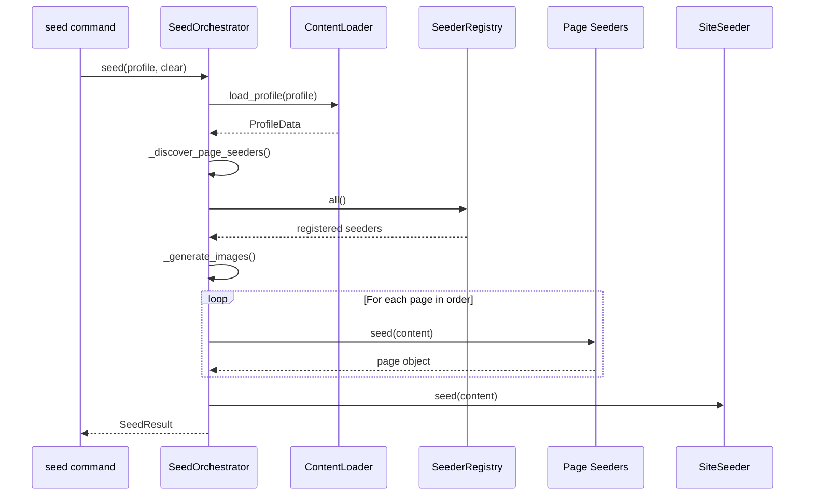

# Seeder Architecture

The SUM Platform uses a modular seeder system that separates content definitions (YAML) from seeding logic (Python). This architecture enables:

- **Reusable seeders**: Write seeding logic once, use it with multiple content profiles.
- **Declarative content**: Define site content in YAML files, not Python code.
- **Extensibility**: Add new page types by registering new seeders.
- **Testability**: Test seeding logic independently of content.

---

## Directory Structure

```
sum-platform/
├── seeders/                    # Seeder infrastructure (Python modules)
│   ├── __init__.py             # Public API exports
│   ├── base.py                 # BaseSeeder, SeederRegistry, helpers
│   ├── content.py              # ContentLoader, ProfileData
│   ├── exceptions.py           # Custom exception classes
│   ├── images.py               # ImageManager, placeholder generation
│   ├── orchestrator.py         # SeedOrchestrator, SeedPlan, SeedResult
│   ├── site.py                 # SiteSeeder (branding, navigation)
│   └── pages/                  # Page-specific seeders
│       ├── __init__.py
│       ├── home.py             # HomePageSeeder
│       ├── about.py            # AboutPageSeeder
│       ├── services.py         # ServicesPageSeeder
│       ├── portfolio.py        # PortfolioPageSeeder
│       ├── blog.py             # BlogPageSeeder
│       ├── contact.py          # ContactPageSeeder
│       ├── legal.py            # LegalPageSeeder
│       ├── standard.py         # StandardPageSeeder
│       └── utils.py            # Shared utilities
│
├── content/                    # YAML content profiles
│   └── sage-stone/             # Example profile
│       ├── site.yaml           # Brand config, colors, contact info
│       ├── navigation.yaml     # Header/footer navigation structure
│       └── pages/              # Page content
│           ├── home.yaml
│           ├── about.yaml
│           ├── services.yaml
│           ├── portfolio.yaml
│           ├── blog.yaml
│           ├── contact.yaml
│           └── legal.yaml
│
└── core/sum_core/test_project/
    └── home/management/commands/
        └── seed.py             # Management command (thin wrapper)
```

---

## Core Concepts

### Content Profiles

A **content profile** is a directory under `content/` containing YAML files that define a complete site's content. Each profile includes:

| File | Purpose |
|------|---------|
| `site.yaml` | Brand configuration (company info, colors, typography, social links) |
| `navigation.yaml` | Header menu structure and footer sections |
| `pages/*.yaml` | Individual page content (one file per page) |

### The Orchestrator

The `SeedOrchestrator` coordinates the entire seeding process:

1. Loads content from a profile via `ContentLoader`
2. Discovers and initializes page seeders from the registry
3. Generates placeholder images via `ImageManager`
4. Seeds pages in dependency order
5. Seeds site-level configuration (branding, navigation)

```python
from seeders import SeedOrchestrator

orchestrator = SeedOrchestrator()
orchestrator.seed("sage-stone", clear=True)
```

### Page Seeders

Page seeders are registered with `SeederRegistry` and handle specific page types:

```python
from seeders import BaseSeeder, SeederRegistry

@SeederRegistry.register("about")
class AboutPageSeeder(BaseSeeder):
    def seed(self, content: dict, clear: bool = False) -> None:
        # Create or update the about page
        pass

    def clear(self) -> None:
        # Remove seeded content
        pass
```

### Dependency Injection

The orchestrator injects dependencies into seeders that declare them:

```python
class MySeeder(BaseSeeder):
    def __init__(
        self,
        *,
        content_loader: ContentLoader,  # Injected automatically
        image_manager: ImageManager,    # Injected automatically
    ) -> None:
        self.content_loader = content_loader
        self.image_manager = image_manager
```

---

## Public API

### Exports from `seeders`

```python
from seeders import (
    # Core classes
    BaseSeeder,
    SeederRegistry,
    ContentLoader,
    ProfileData,
    SeedOrchestrator,
    SeedPlan,
    SeedResult,
    SiteSeeder,
    ImageManager,

    # Helper functions
    create_child_page,
    generate_slug,
    get_or_create_page,
    publish_page,

    # Exceptions
    SeederError,
    SeederContentError,
    SeederPageError,
    SeederNotFoundError,
    SeederRegistrationError,
    SeederRegistryError,
    SeederSlugError,
    ContentProfileError,
    ContentSchemaError,
)
```

### SeedOrchestrator

The main entry point for seeding operations.

#### Constructor

```python
SeedOrchestrator(
    content_dir: Path | None = None,      # Override content directory
    content_loader: ContentLoader | None = None,
    image_manager: ImageManager | None = None,
    image_manifest: Iterable[ImageSpec] | None = None,
    image_prefix: str = "SEED",           # Prefix for generated image titles
    page_order: Iterable[str] | None = None,  # Override page seeding order
    page_seeder_classes: dict | None = None,  # Override seeder registry
    site_seeder_class: type = SiteSeeder,
    auto_discover: bool = True,           # Auto-discover page seeders
)
```

#### Methods

| Method | Description |
|--------|-------------|
| `list_profiles()` | Returns list of available profile names |
| `plan(profile)` | Returns a `SeedPlan` without writing data |
| `seed(profile, clear=False, dry_run=False)` | Seeds a profile; returns `SeedPlan` or `SeedResult` |

### ContentLoader

Loads and validates YAML content profiles.

```python
loader = ContentLoader(content_dir=Path("content"))
profiles = loader.list_profiles()  # ["sage-stone"]
data = loader.load_profile("sage-stone")  # ProfileData
```

### ProfileData

Container for loaded profile content:

```python
@dataclass(frozen=True)
class ProfileData:
    site: dict[str, Any]           # Contents of site.yaml
    navigation: dict[str, Any]     # Contents of navigation.yaml
    pages: dict[str, dict]         # {page_name: page_content}
```

### ImageManager

Generates and caches placeholder images.

```python
manager = ImageManager(prefix="SEED")
image = manager.generate("HERO_IMAGE", 1920, 1080, label="Hero Kitchen")
images = manager.generate_manifest(IMAGE_MANIFEST)
```

---

## Management Command

The `seed` management command provides CLI access to the orchestrator.

### Usage

```bash
# Seed with default profile (sage-stone if available)
python manage.py seed

# Seed a specific profile
python manage.py seed sage-stone

# Clear existing content before seeding
python manage.py seed sage-stone --clear

# Override content directory
python manage.py seed sage-stone --content-path ./my-content

# Dry run (validate and print plan without writing)
python manage.py seed sage-stone --dry-run
```

### Options

| Option | Description |
|--------|-------------|
| `profile` | Content profile name (optional if default exists) |
| `--clear` | Delete existing seeded content before re-seeding |
| `--content-path` | Override the content directory (default: `./content`) |
| `--dry-run` | Validate content and print plan without writing |

---

## Seeding Flow



---

## Page Order

Pages are seeded in a defined order to ensure dependencies are met (e.g., home page exists before navigation references it). The default order is:

1. home
2. about
3. services
4. portfolio
5. blog
6. contact
7. legal

Pages not in this list are seeded alphabetically after the ordered pages.

---

## Image Keys

YAML content can reference images by key. The orchestrator generates these images and passes them to seeders:

```yaml
# In page YAML
hero:
  image: HERO_IMAGE  # References the image key
```

```python
# In seeder
image = images.get("HERO_IMAGE")  # WagtailImage object
```

Standard image keys are defined in `seeders/images.py`:

| Key | Dimensions | Purpose |
|-----|------------|---------|
| `HERO_IMAGE` | 1920x1080 | Main hero background |
| `LOGO` | 300x80 | Header/footer logo |
| `FAVICON` | 64x64 | Browser favicon |
| `FOUNDER_IMAGE` | 800x1000 | Team portraits |
| `SERVICE_*` | 600x400 | Service illustrations |
| `PORTFOLIO_*` | 800x600 | Portfolio images |
| `BLOG_*` | 1200x600 | Blog featured images |

---

## Relationship to Legacy Seeders

The modular seeder system replaces the monolithic `seed_sage_stone.py` command. Key differences:

| Aspect | Legacy | Modular |
|--------|--------|---------|
| Content | Hardcoded in Python | YAML files |
| Structure | Single 3,000+ line file | Multiple focused modules |
| Reusability | Copy and modify | Register and configure |
| Testing | Full integration only | Unit test individual seeders |

### Migration Path

The legacy `seed_sage_stone` command has been replaced by `seed sage-stone`. Both produce the same site structure; the modular version reads content from `content/sage-stone/`.

---

## See Also

- [Creating Content Profiles](CREATING-CONTENT-PROFILES.md) — Guide to creating new profiles
- [Extending Seeders](extending-seeders.md) — Legacy patterns (still valid for custom commands)
- [Sage & Stone Seeder](../user/seed-sage-stone.md) — User documentation
